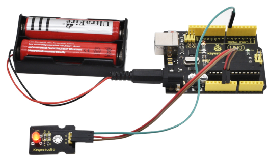

# KS0232 keyestudio Red Piranha LED Module


## 1. Introduction

This is a red LED module. The main function is to control a plugin LED on and off. When connecting to ARDUINO, after programming, it will emit red light color.

The pin pitch of 3Pin is 2.54mm.

This LED module has 3 Pins; - pin is connected to ground, + pin is connected to VCC（3.3-5V）, S pin is for signal control; you can set the High or Low level to control the LED on and off. 

You can combine with other sensors to do various interactive experiments. 

You can also choose other LED modules to emit different light color like blue, green, yellow and white.

## 2. Specification

- Control interface: Digital
- Working voltage: DC 3.3-5V
- Pin pitch: 2.54mm
- LED color: red
- Easy to use
- Useful for light projects

## 3. Technical Details

- Dimensions: 34mm * 20mm * 11mm
- Weight: 2.3g

## 4. Connection Diagram

Download code :  [Code](./Code.7z)

Connect the red LED module to control board using three jumper wires. Then connect the control board to your PC with a USB cable.

```c
int led = 7; 

void setup()
{
   pinMode(led, OUTPUT);     //Set Pin7 as output
}

void loop()
{  
   digitalWrite(led, HIGH);   //Turn off led
   delay(1000);
   digitalWrite(led, LOW);    //Turn on led
   delay(1000);
}
```

## 5. Result

The LED will flash on for one second, then off for one second, repeatedly and alternately.

If it doesn’t, make sure you have assembled the circuit correctly and verified and uploaded the code to your board.

